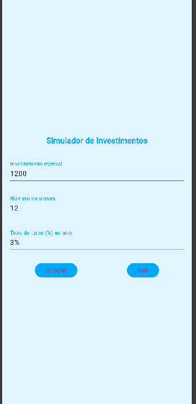
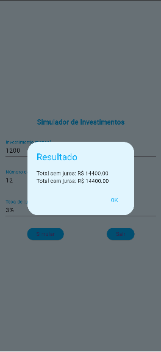

# Atividade 01 - Simulador Investimentos

## Descrição do Projeto 
O projeto consiste em um Simulador de Investimentos, desenvolvido com o objetivo de permitir ao usuário calcular o crescimento de um investimento ao longo do tempo.

A interface é simples e intuitiva, contendo campos para inserção de dados essenciais, como:
- > Investimento mensal: valor que será aplicado todos os meses
- > Número de meses: período total do investimento
- > Taxa de juros (% ao ano): rendimento aplicado sobre o valor investido
  
- Ao preencher os dados, o usuário pode clicar no botão "Simular" para visualizar o resultado do investimento.
- Há também um botão "Sair", que permite encerrar a aplicação ou retornar à tela anterior.

## FIGMA 
- > Link: https://www.figma.com/proto/uNNmBtQ1Q8To6bLlf25qRe/Investimentos?node-id=1-347&p=f&t=3I79tH8vv6Ha4UCq-1&scaling=scale-down&content-scaling=fixed&page-id=0%3A1&starting-point-node-id=1%3A347

# Print das Telas 




## Tecnologias 
- > Dart – linguagem principal do projeto
- > Flutter – framework utilizado para construção da interface
- > Material Design – padrão visual utilizado nos componentes

## Passo a passo de como executar
1. Instalar o Flutter
```git hub
 Baixe em: https://flutter.dev/docs/get-started/install
```

2. Verifique a instalação: 
```git hub 
flutter doctor
```

3. Clonar o repositório
```git hub
git clone <url-do-repositorio>
```

4. Acessar a pasta do projeto
```git hub
cd nome-do-projeto
```

5. Instalar dependências
```git hub
flutter pub get
```

6. Executar o projeto
```git hub 
flutter run
```

7. Utilizar o app
```git hub
Preencha os campos
Clique em Simular
Veja o resultado do investimento
```


